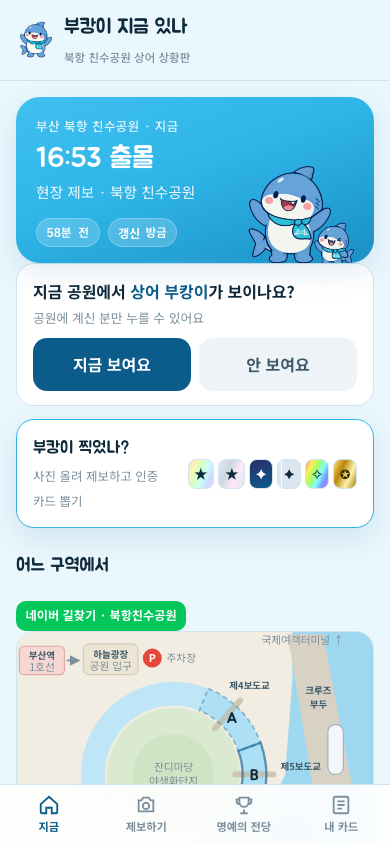
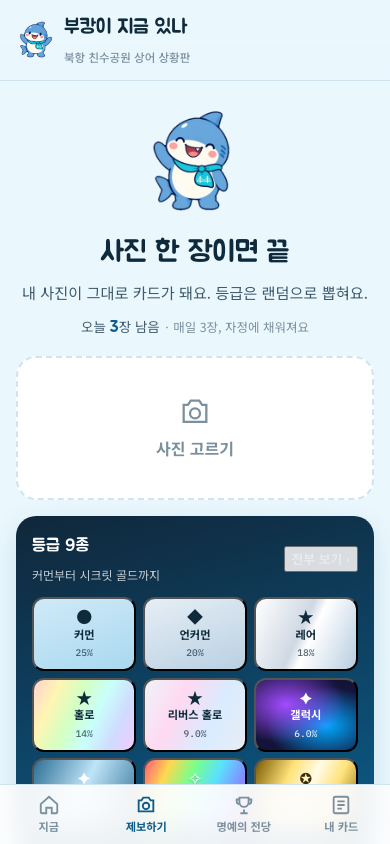
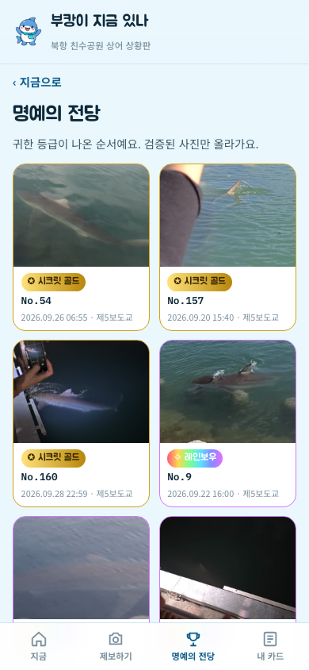
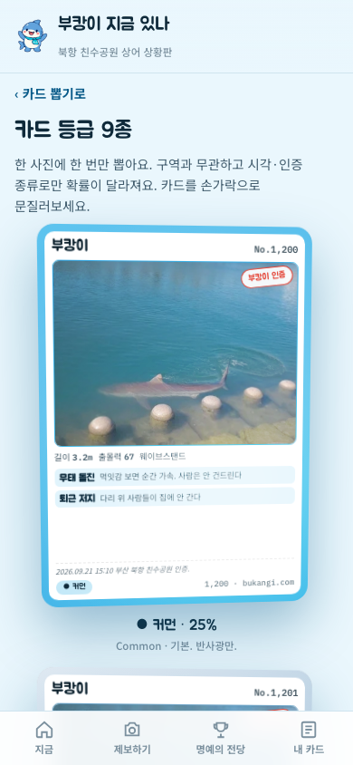

**English** | [한국어](README.ko.md)

# Is Bukangi Here Now? (부캉이 지금 있나, bukangi.com)

A citizen-reported status board for "Bukangi," the shark that showed up at Bukhang Waterfront Park in Busan's North Port in September 2026.
When someone at the park uploads a photo of the shark or taps "I see it / I don't," the last-seen time updates right away.

- Service: https://bukangi.com (launched 2026-09-22, developed with Claude Code)
- Write-up, including why it is built this way: [English](https://pizzalist.tistory.com/16) · [Korean](KO_POST_URL)

<p align="center">
  
  
  
  
</p>
<p align="center"><sub>Home · Report · Hall of Fame · Card rarity tiers (actual screens, 2026-09-30)</sub></p>

## Architecture

```
 User ──┬─ bukangi.com ──────▶ Cloudflare Workers static assets (React app)
        │                      └ worker.js: forwards only /c/<card> previews to the API
        │
        └─ api.bukangi.com ──▶ Cloudflare Tunnel (only allowed paths pass; everything else 404s)
                                  │
                                  ▼  a single Mac mini (no external ports opened; listens on 127.0.0.1 only)
                       Express server :8787 ── SQLite (WAL) + photo folder
                            ├─ AI screening engine :8788 (jev-visual + Qwen3.5-4B-4bit, MLX, local only)
                            └─ Discord webhook (decision alerts + signed approve/reject/undo links)
```

- **Photos** are served from the Cloudflare edge cache; status reads and **writes** (reports, buttons) go to the Mac mini. Caching notes and load tests: [`docs/operations.md`](docs/operations.md).
- The **admin page** opens only on a separate host (admin) and authenticates with a Bearer token.

## AI photo screening

- Engine: [jev-visual](https://github.com/hr98w/jev-visual) (MIT) + Qwen3.5-4B-4bit on MLX, pinned to the commit used for evaluation. Instead of generating an answer, it reads the probability of each answer option.
- Publish probability ≥ 0.7 means auto-approve, ≤ 0.3 means auto-reject, and anything in between goes to the operator. Every automatic decision is also sent to Discord with a signed link to overturn it.
- Evaluation on 146 real reports: 69.2% handled automatically, 101/101 automatic decisions correct. The threshold was chosen on the same 146 photos and there were only 14 rejected samples, so treat this as an optimistic upper bound. Details: [`docs/screening.md`](docs/screening.md), [`eval/README.md`](eval/README.md)

## Security and privacy

- The server listens only on 127.0.0.1 and no router ports are opened. Only the paths the tunnel allows are exposed (`ops/cloudflared-config.example.yml`).
- The admin token and Discord signed links are compared with `timingSafeEqual`, and the server will not start without a token. Uploads are checked by their leading bytes, and photo IDs are unguessable random values.
- Per-IP rate limits, request size limits, and prepared statements for all SQL.
- IP addresses and browser information are kept only as hashes ([`docs/data.md`](docs/data.md)). Google Analytics loads only when `VITE_GA_ID` is set. Report photos, the production DB, and secrets are not in this repository.

## Folders

```
src/            React + TypeScript UI (Vite)
server/         Express API, SQLite, AI screening integration, Discord alerts, card images
eval/           AI photo screening evaluation scripts and results (report IDs anonymized)
ops/            Mac mini ops scripts, launchd config, example tunnel config, jev engine installer
test/           Load test and browser flow check (Playwright)
public/         Static assets
worker.js       Cloudflare Worker (forwards only card preview paths to the API)
docs/           Deployment, operations, AI screening, data, third-party notices (English and Korean)
```

## Running locally

Requirements: Node.js (v25 in the development environment) and npm. To also run the AI screening engine, you need an Apple Silicon Mac (MLX) and Python 3.13.

```bash
npm install

# 1) UI only
npm run dev                                   # http://localhost:5173

# 2) With the API server
export ADMIN_TOKEN=$(openssl rand -hex 24)    # admin token (required)
export BUKANG_DATA=~/bukang-dev               # folder where the DB and photos are stored
export SITE_URL=http://localhost:5173         # UI origin that calls the report/admin APIs
export SCREEN_ENGINE=off                      # no screening engine (a human reviews on the admin page)
npm run seed                                  # sample data (optional)
npm run server                                # http://127.0.0.1:8787 , admin page at #/admin
```

### Key environment variables

| Name | Default | Description |
|---|---|---|
| `ADMIN_TOKEN` | (required) | Admin API token. 32+ random characters recommended |
| `BUKANG_DATA` | `~/bukang` | Location of the SQLite DB and photo folder |
| `PORT` / `HOST` | `8787` / `127.0.0.1` | Server address. Loopback only, in production too |
| `SITE_URL`, `ALLOWED_ORIGINS` | | UI origins allowed to call the report/admin APIs |
| `PUBLIC_URL` | | The API's external URL. If set, photos are returned as absolute URLs |
| `SERVE_STATIC` | `1` | Whether the server serves `dist/` and card images itself |
| `SCREEN_ENGINE` | `claude` | Photo screening engine: `claude` / `api` / `jev` / `off` |
| `JEV_URL`, `JEV_THRESHOLD` | `http://127.0.0.1:8788`, `0.7` | jev engine URL and auto-approve threshold (auto-reject if ≤ 1 − threshold) |
| `ANTHROPIC_API_KEY` | | Required only when `SCREEN_ENGINE=api` |
| `DISCORD_WEBHOOK` | | If set, sends decision alerts and signed links |
| `PARK_RADIUS` | `700` | Park radius (m) within which on-site buttons are accepted |
| `VITE_GA_ID` | (none) | Frontend build value. Google Analytics measurement ID. Leave empty to disable GA |

### AI screening engine (optional)

```bash
./ops/jev/setup.sh          # installs jev-visual (pinned commit) and the model, registers with launchd, 127.0.0.1:8788
export SCREEN_ENGINE=jev
npm run server
```

### Production deployment

Domain, the Mac mini (launchd), the Cloudflare Tunnel, and the Workers frontend: [`docs/deploy.md`](docs/deploy.md). Security checklist and load tests: [`docs/operations.md`](docs/operations.md).

## License

MIT. See [`LICENSE`](LICENSE). Third-party code: [`docs/third-party.md`](docs/third-party.md). jev-visual (MIT) and the Qwen3.5 models (Apache-2.0) are downloaded at install time and are not included in this repository.
